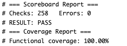
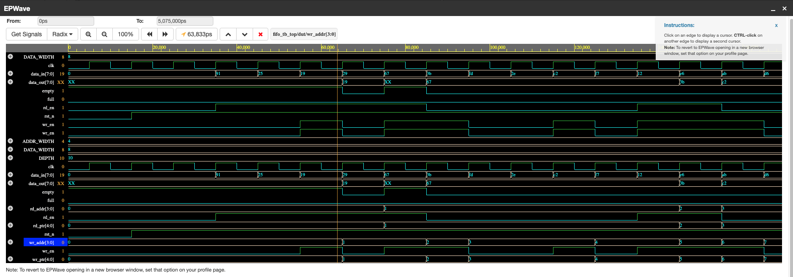

# Synchronous FIFO with SystemVerilog Verification Environment

A parameterized synchronous FIFO designed in SystemVerilog, verified using a
class-based testbench built around a driver / monitor / scoreboard
architecture, with constrained-random stimulus, functional coverage, and
SystemVerilog Assertions (SVA).

## Design

- Parameterized data width (default 8 bits) and depth (default 16 entries)
- Standard FIFO interface: `wr_en`, `rd_en`, `data_in`, `data_out`, `full`, `empty`
- First-word fall-through (combinational read)
- Uses the classic "extra pointer bit" technique to distinguish full from
  empty without a separate counter
- Handles simultaneous read/write on the same cycle correctly

## Verification Architecture

- **`fifo_if`** — SystemVerilog interface bundling the DUT's signals for the
  class-based testbench
- **`fifo_txn`** — randomizable transaction (a potential write and/or read),
  with constraints biasing stimulus toward filling the FIFO and forcing
  frequent simultaneous read+write, since that's the trickiest logic path
- **`fifo_driver`** — drives randomized transactions onto the DUT interface
- **`fifo_monitor`** — passively samples DUT pins each cycle and reconstructs
  transactions for the scoreboard
- **`fifo_scoreboard`** — runs an independent software reference model (a
  SystemVerilog queue) and flags any mismatch against actual DUT output
- **`fifo_coverage`** — functional coverage tracking full/empty conditions
  and simultaneous read+write scenarios, including cross-coverage against
  full/empty
- **`fifo_assertions`** — SVA checking for full+empty simultaneously, and
  unknown (X) values on valid reads/writes

500 constrained-random transactions are run through the environment per
simulation.

## What I Found

*[Fill this in after you run it — this is the most important part of the
whole README. Example: "Constrained-random testing surfaced a case where
simultaneous read+write while the FIFO was exactly full caused [specific
behavior]." If your first pass came back clean, that's a legitimate result
too — say what you specifically stress-tested for and why: "Biased
constraints toward the full/empty boundary and simultaneous read+write
since that's where FIFO bugs most commonly hide, and the scoreboard/
assertions confirmed correct behavior across 500 randomized transactions."]*

## Coverage Results

*[Insert your final coverage percentage here after running, and add your
screenshot to `docs/coverage_report.png`]*

## Waveform Example

## How to Run

See [`sim/run_instructions.md`](sim/run_instructions.md). Built and tested
using Aldec Riviera-PRO on EDA Playground for full SystemVerilog class and
mailbox support.

## Why I Built This

Built to go deeper on verification methodology than my earlier RTL projects
(an FSM-based FPGA UART packet processor, a Verilog BCD arithmetic logic
unit) — specifically to get hands-on with the class-based driver/monitor/
scoreboard architecture, constrained-random verification, functional
coverage, and assertions that production verification teams actually use.
